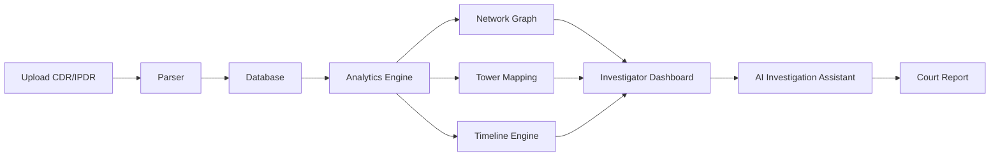
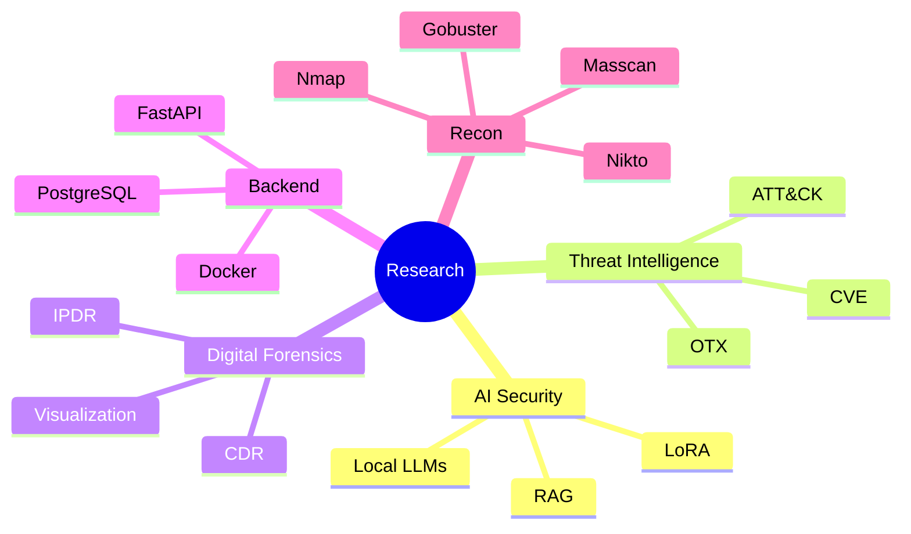
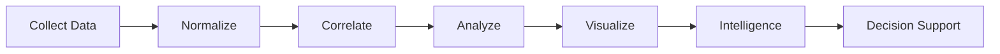
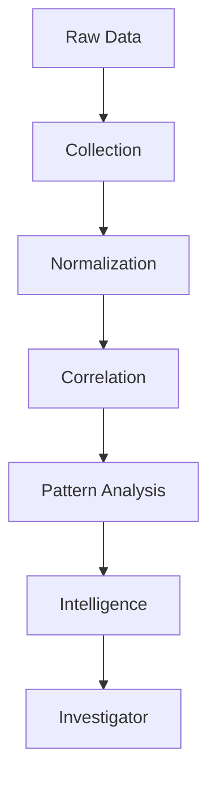
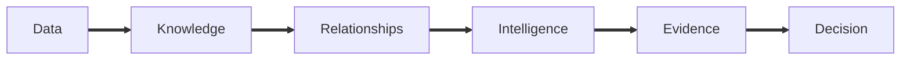

<!-- ========================================================= -->
<!--                  SIDDHARTH SINHA                          -->
<!--        Cybersecurity • AI • Digital Forensics            -->
<!-- ========================================================= -->

<div align="center">


<br><br>

[](https://git.io/typing-svg)

<br>

<p>

<a href="mailto:siddharthsinha1125@gmail.com">

</a>

<a href="https://github.com/Sid1125">

</a>

<a href="https://www.linkedin.com/in/ssinha1125/">

</a>

<a href="https://tryhackme.com/p/sid1125">

</a>

</p>


</div>

---

# > ACCESSING PERSONNEL RECORD...

```text
████████████████████████████████████████████████████████████████

       NATIONAL CYBER OPERATIONS DATABASE

████████████████████████████████████████████████████████████████

IDENTITY VERIFIED

NAME            Siddharth Sinha
STATUS          ACTIVE
CLEARANCE       RESEARCH
DIVISION        CYBERSECURITY
LOCATION        INDIA

LOADING MODULES...

■■■■■■■■■■■■■■■■■■■■■■■■■■■■■■■■■■■■■■ 100%

INITIALIZATION COMPLETE

████████████████████████████████████████████████████████████████
```

<br>

<table>
<tr>

<td width="62%">

# Siddharth Sinha

Cybersecurity student focused on **AI-powered security systems**, **digital forensics**, **telecom intelligence**, and **backend engineering**.

I enjoy building platforms that transform raw security data into actionable intelligence—from reconstructing communication networks to automating reconnaissance pipelines and designing privacy-first AI systems capable of operating in air-gapped environments.

Instead of building isolated tools, I build **complete investigation ecosystems**.

### Current Mission

```text
[✓] Telecom Investigation Platforms

[✓] AI-assisted Threat Intelligence

[✓] Digital Forensics

[✓] SOC Automation

[✓] Offline LLM Deployment

[✓] Network Intelligence
```

</td>

<td width="38%">


</td>

</tr>
</table>

---

# CLASSIFIED DOSSIER

<table>

<tr>

<td>

```yaml
Name:

  Siddharth Sinha

Education:

  B.Tech Computer Science Engineering

University:

  Amity University Haryana

CGPA:

  8.46

Graduation:

  2027

```

</td>

<td>

```yaml
Research:

- AI Security

- Telecom Forensics

- Threat Intelligence

- Backend Systems

- Network Analysis

- Digital Investigations

```

</td>

<td>

```yaml
Currently:

Building forensic-grade

security software

for investigation,

analysis,

automation

and intelligence.

```

</td>

</tr>

</table>

---

# OPERATIONAL STATUS

<table>

<tr>

<td align="center">

### AI Systems

██████████

ONLINE

</td>

<td align="center">

### Threat Intelligence

██████████

ONLINE

</td>

<td align="center">

### Digital Forensics

██████████

ONLINE

</td>

</tr>

<tr>

<td align="center">

### Backend Engineering

██████████

ONLINE

</td>

<td align="center">

### Vulnerability Assessment

██████████

ONLINE

</td>

<td align="center">

### Research

██████████

ONLINE

</td>

</tr>

</table>

---

# TECHNOLOGY ARSENAL

<div align="center">


<br><br>


</div>

---

<div align="center">

## CYBERSECURITY TOOLKIT

| Recon | Exploitation | Analysis | Intelligence |
|--------|--------------|----------|--------------|
| Nmap | Burp Suite | Wireshark | CVE |
| Masscan | Metasploit | NetworkX | AlienVault OTX |
| Gobuster | SQLMap | Pandas | AbuseIPDB |
| Nikto | OWASP | D3.js | MITRE ATT&CK |

</div>

---

<p align="center">


</p>

# ACTIVE OPERATIONS

```
<!-- ========================================================= -->
<!--                  ACTIVE OPERATIONS                        -->
<!-- ========================================================= -->

<div align="center">

# ACTIVE OPERATIONS

*"Every system tells a story. My job is building the systems that uncover it."*

</div>

<br>

<table>
<tr>
<td width="100%">

# ◉ OPERATION ARGUS


<br>

```text
CLASSIFICATION     : RESTRICTED
STATUS             : OPERATIONAL
TYPE               : Telecom Intelligence Platform
ENVIRONMENT        : Offline / Air-Gapped Compatible
PRIMARY LANGUAGE   : Python
ARCHITECTURE       : FastAPI + PostgreSQL + D3 + AI
```

### Mission Brief

Project ARGUS is a forensic-grade **CDR/IPDR investigation platform** designed for digital investigators and cybersecurity analysts.

Instead of simply displaying telecom records, ARGUS reconstructs relationships, movement patterns, communication behaviour, and network intelligence from millions of records.

Designed around offline-first architecture, the platform can operate entirely inside secure environments without cloud connectivity.

---

### Intelligence Capabilities

<table>
<tr>

<td width="50%">

### Investigation

- Communication Graph Analysis
- Tower Movement Mapping
- Timeline Reconstruction
- Relationship Detection
- Number Profiling
- Pattern Correlation

</td>

<td width="50%">

### AI & Analytics

- Investigation Summaries
- Behaviour Analysis
- Suspicious Cluster Detection
- Network Centrality
- Offline LLM Support
- Court-ready Report Generation

</td>

</tr>
</table>

---

### System Architecture



---

### Technology Stack

<p>


</p>

---

<div align="center">

<a href="https://github.com/sid1125/tifm-cdr-ipdr-visualizer">


</a>

</div>

</td>
</tr>
</table>

<br><br>

---

<br>

<table>
<tr>
<td width="100%">

# ◉ OPERATION SENTINEL


<br>

```text
CLASSIFICATION     : INTERNAL
STATUS             : ACTIVE DEVELOPMENT
TYPE               : AI Threat Intelligence Platform
DEPLOYMENT         : Offline SOC
```

### Mission Brief

Project SENTINEL is an AI-powered security operations platform built for autonomous network discovery, vulnerability assessment, threat intelligence, and local-first security analytics.

The objective is to create an investigator's command centre capable of continuously discovering infrastructure, enriching findings with vulnerability intelligence, and providing natural language interaction through offline LLMs.

---

### Core Modules

<table>

<tr>

<td>

Network Discovery

- ARP Discovery
- Host Enumeration
- Port Scanning
- Service Detection

</td>

<td>

Threat Intelligence

- CVE Lookup
- Vulnerability Correlation
- Risk Prioritisation
- Asset Inventory

</td>

<td>

AI Layer

- Local LLM
- Natural Language Queries
- Report Generation
- Security Assistant

</td>

</tr>

</table>

---

### Platform Flow

```mermaid

graph TD

Network

-->

Discovery

-->

Fingerprinting

-->

Threat Intelligence

-->

Risk Engine

-->

AI Assistant

-->

Dashboard

```

---

### Technology

<p>


</p>

---

<div align="center">

<a href="https://github.com/Sid1125/Project-SENTINEL">


</a>

</div>

</td>
</tr>
</table>

<br>

---

<br>

<table>

<tr>

<td width="100%">

# ◉ OPERATION AGENTRECON


```text
STATUS             : DEPLOYED
TYPE               : Automated Recon Pipeline
MISSION            : Attack Surface Intelligence
```

AgentRecon orchestrates multiple reconnaissance tools into a unified intelligence pipeline capable of scanning, enumerating, enriching, and prioritising findings automatically.

Rather than replacing analysts, it accelerates the reconnaissance phase by correlating scan results with real-world threat intelligence.

---

### Recon Pipeline

```mermaid
graph LR

Target

-->

Nmap

-->

Masscan

-->

Nikto

-->

Gobuster

-->

SSLyze

-->

CVE Intelligence

-->

Risk Ranking

-->

HTML Report
```

---

### Recon Modules

- Host Discovery
- Port Enumeration
- Web Enumeration
- TLS Analysis
- CVE Enrichment
- False Positive Reduction
- HTML Reporting
- Machine Learning Prioritisation

---

<p>


</p>

---

<div align="center">

<a href="https://github.com/sid1125/AgentRecon">


</a>

</div>

</td>

</tr>

</table>

<br>

<p align="center">


</p>

# RESEARCH SYSTEMS
<!-- ========================================================= -->
<!--                  RESEARCH SYSTEMS                         -->
<!-- ========================================================= -->

<div align="center">

# RESEARCH SYSTEMS

*"Research prototypes, AI systems, and full-stack platforms engineered to solve complex real-world problems."*

</div>

<br>

<table>
<tr>

<td width="48%">

# AI RESEARCH AGENT


```text
STATUS      : STABLE
CATEGORY    : Retrieval-Augmented Generation
MODE        : Fully Offline
```

### Overview

A private knowledge assistant built for environments where confidentiality matters.

Instead of relying on cloud-hosted AI, the system combines semantic retrieval, traditional information retrieval, and locally deployed language models to answer questions grounded entirely in user-owned documents.

---

### Features

- Local document ingestion
- Hybrid retrieval
- TF-IDF ranking
- Embedding search
- Extractive fallback
- Hallucination-resistant responses
- Privacy-first architecture

---

### Stack

Python • FastAPI • TensorFlow • Keras • TF-IDF • Sentence Transformers • Streamlit

<br>

<div align="center">

<a href="https://github.com/Sid1125/Primitive-Research-RAG">


</a>

</div>

</td>

<td width="4%"></td>

<td width="48%">

# F1 INSIGHT


```text
STATUS      : RELEASED
CATEGORY    : Predictive Analytics
```

### Overview

A Formula 1 analytics platform capable of predicting race outcomes, evaluating pit strategies, tyre degradation, and historical race trends through machine learning.

Processes telemetry and race history to simulate multiple race scenarios.

---

### Features

- Race prediction
- Strategy simulation
- Driver comparison
- Telemetry analytics
- Interactive dashboards
- AI-assisted querying

---

### Stack

Python • FastAPI • XGBoost • SQLAlchemy • Pandas • Plotly • FastF1

<br>

<div align="center">

<a href="https://github.com/Sid1125/F1-Insight">


</a>

</div>

</td>

</tr>
</table>

<br>

<table>
<tr>

<td width="48%">

# HITMEN


```text
STATUS      : DEPLOYED
CATEGORY    : Community Intelligence
```

### Overview

A crowdsourced reporting platform focused on harmful content tracking and moderation workflows.

The platform enables anonymous reporting, moderation lifecycle management, Discord integration, and escalation pipelines.

---

### Features

- Anonymous reports
- Discord integration
- Moderation workflow
- Escalation tracking
- Real-time updates

---

### Stack

Node.js • JavaScript • Discord API • TailwindCSS

<br>

<div align="center">

<a href="https://github.com/Sid1125/hitmen_epi_prevention">


</a>

</div>

</td>

<td width="4%"></td>

<td width="48%">

# OIA INTERNATIONAL HUB


```text
STATUS      : LIVE
CATEGORY    : University Platform
```

### Overview

A modern international collaboration platform developed for the Office of International Affairs.

Designed to showcase global partnerships, academic programmes, and student engagement through an interactive interface.

---

### Features

- University directory
- Country mapping
- Programme explorer
- Student testimonials
- Responsive UI

---

### Stack

React • Next.js • TailwindCSS

<br>

<div align="center">

<a href="https://global-connect-hub-two.vercel.app/">


</a>

</div>

</td>

</tr>

</table>

<br>

<table>

<tr>

<td width="48%">

# INNOVATHON


```text
STATUS      : LIVE
CATEGORY    : Event Platform
```

### Overview

Complete hackathon management platform supporting event promotion, registrations, judging criteria, sponsor showcases, and participant engagement.

---

### Features

- Competition tracks
- Sponsor showcase
- Event timeline
- Team registration
- Modern UI

---

### Stack

React • Vite • JavaScript • TailwindCSS

<br>

<div align="center">

<a href="https://innovathon2.onrender.com">


</a>

</div>

</td>

<td width="4%"></td>

<td width="48%">

# CLIPSYNC


```text
STATUS      : LIVE
CATEGORY    : Productivity
```

### Overview

A secure clipboard management platform designed for authenticated storage, retrieval, organization, and search of frequently used text snippets.

---

### Features

- Authentication
- Clipboard storage
- Search
- Session management
- Clean dashboard

---

### Stack

HTML • CSS • JavaScript

<br>

<div align="center">

<a href="https://clip-sync-three.vercel.app/sign-in.html">


</a>

</div>

</td>

</tr>

</table>

<br>

<table>

<tr>

<td width="100%">

# MISSION VEERANGANA


```text
STATUS      : COMPLETED
CATEGORY    : Public Awareness
```

Developed a dedicated platform supporting a women's safety initiative conducted in collaboration with Haryana Police and Amity University.

The platform centralized event information, workshop resources, registrations, and participant communication while maintaining an accessible and responsive interface.

<br>

<div align="center">

<a href="https://mission-veerangana-site.onrender.com/">


</a>

</div>

</td>

</tr>

</table>

---

<p align="center">


</p>

<div align="center">

# TECHNICAL EXPERTISE

</div>

<table>

<tr>

<td width="25%">

### Offensive Security

- Vulnerability Assessment
- Penetration Testing
- Threat Modelling
- Web Security
- OWASP Top 10
- Network Enumeration

</td>

<td width="25%">

### AI Engineering

- Local LLMs
- RAG Pipelines
- Embeddings
- LoRA Fine-Tuning
- TensorFlow
- XGBoost

</td>

<td width="25%">

### Backend Systems

- FastAPI
- Node.js
- SQLAlchemy
- PostgreSQL
- SQLite
- REST APIs
- WebSockets

</td>

<td width="25%">

### Visualization

- D3.js
- Leaflet
- Plotly
- Streamlit
- Chart.js
- NetworkX

</td>

</tr>

</table>

<br>

<div align="center">


</div>

---

<p align="center">


</p>

# EXPERIENCE LOG
<!-- ========================================================= -->
<!--                   EXPERIENCE LOG                          -->
<!-- ========================================================= -->

<div align="center">

# EXPERIENCE LOG

*"Every deployment leaves behind lessons. Every investigation improves the next."*

</div>

<br>

```text
──────────────────────────────────────────────────────────────────────────────
                           OPERATIONAL TIMELINE
──────────────────────────────────────────────────────────────────────────────
```

<table width="100%">

<tr>

<td width="18%" align="center">

## 2026

</td>

<td width="82%">

### CYBER SECURITY SUMMER INTERN

**Gurugram Police Cyber Security Summer Internship (GPCSSI)**

**MISSION PROFILE**

Worked on investigation-focused cybersecurity projects inspired by real operational requirements. Designed systems centered around telecom intelligence, AI-assisted analysis, backend architecture, and digital investigation workflows.

**AREAS OF WORK**

- Investigation platform architecture
- Telecom data analysis
- AI-assisted intelligence workflows
- Backend engineering
- Secure system design

</td>

</tr>

<tr>

<td align="center">

## 2025

</td>

<td>

### STUDENT INTERN

**Amity University Haryana**

Designed and developed institutional software platforms while contributing to backend services, data processing pipelines, automation, and university technology initiatives.

**RESPONSIBILITIES**

- Backend development
- Database management
- Internal software systems
- Workflow automation
- UI integration

</td>

</tr>

<tr>

<td align="center">

## 2025

</td>

<td>

### CYBER SECURITY INTERN

**National Informatics Centre (MeitY)**

Participated in vulnerability assessment and security analysis activities across government technology infrastructure.

Worked with reconnaissance and assessment tools to identify potential weaknesses while learning secure development practices within government environments.

**TOOLS**

- Nmap
- Nikto
- HTTPX
- SSLyze
- Wappalyzer
- Nuclei

</td>

</tr>

<tr>

<td align="center">

## 2024

</td>

<td>

### CYBER SECURITY INTERN

**Embrizon Technologies**

Received practical exposure to penetration testing, reconnaissance, vulnerability assessment, reporting, and cybersecurity methodologies.

</td>

</tr>

<tr>

<td align="center">

## 2024

</td>

<td>

### WEB DEVELOPMENT INTERN

**Prodigy InfoTech**

Built responsive web applications while strengthening frontend engineering practices and JavaScript development.

</td>

</tr>

</table>

---

<div align="center">

# CERTIFICATIONS

</div>

<table>

<tr>

<td width="50%">

### Cybersecurity

- Fortinet Certified Fundamentals
- IBM Cybersecurity Fundamentals
- Cisco Introduction to Cybersecurity

</td>

<td width="50%">

### Development

- Google Cloud Fundamentals
- Google Generative AI
- Responsive Web Design
- JavaScript Algorithms & Data Structures

</td>

</tr>

</table>

---

<div align="center">

# ACHIEVEMENTS

</div>

<table>

<tr>

<td width="33%" align="center">

## 🏆

### IIT Bombay CTF

13th Place

IEEE-CS × IIT Bombay

Trust Lab

</td>

<td width="33%" align="center">

## ⚔

### TryHackMe

100-Day Streak

Level

0x8 HACKER

</td>

<td width="33%" align="center">

## 🚀

### SIH 2024

Participant

National Innovation

Challenge

</td>

</tr>

</table>

---

<div align="center">

# EDUCATION

</div>

<table>

<tr>

<td width="100%">

## Bachelor of Technology

**Computer Science Engineering**

Amity University Haryana

2023 — 2027

**CGPA**

```text
8.46 / 10.00
```

### Leadership

- Mission Veerangana Organising Team
- Former Nihon Culture Club Coordinator
- University Digital Club Member

</td>

</tr>

</table>

---

<p align="center">


</p>

<div align="center">

# GITHUB ANALYTICS

</div>

<br>

<div align="center">


</div>

<br>

<div align="center">


</div>

---

<div align="center">

# CONTRIBUTION GRAPH


</div>

---

<div align="center">

# TROPHIES


</div>

---

<div align="center">

# CURRENT RESEARCH

</div>

```text
██████████████████████████████████████████████████████████████████

ACTIVE RESEARCH DIRECTIVES

[01] Telecom Intelligence Systems

[02] Digital Investigation Platforms

[03] AI-assisted Threat Hunting

[04] Local Language Models

[05] Backend Architecture

[06] Network Intelligence

[07] Automated Reconnaissance

[08] MITRE ATT&CK Simulation

██████████████████████████████████████████████████████████████████
```

---

<div align="center">

# CURRENT TECHNOLOGY RADAR

</div>



---

<p align="center">


</p>

# MISSION CONTROL
<!-- ========================================================= -->
<!--                    MISSION CONTROL                        -->
<!-- ========================================================= -->

<div align="center">

# MISSION CONTROL

*"Turning telemetry into intelligence."*

</div>

<br>

<table>

<tr>

<td width="34%">

## CURRENT OBJECTIVE

```text
PRIMARY TARGET

Build investigation-grade
cybersecurity platforms
capable of operating
entirely offline.

STATUS

██████████████████

ACTIVE
```

</td>

<td width="33%">

## CURRENT STACK

```text
FastAPI

PostgreSQL

React

Python

Docker

Ollama

NetworkX

D3.js

Leaflet
```

</td>

<td width="33%">

## CURRENT FOCUS

```text
Telecom Intelligence

Digital Forensics

Threat Intelligence

AI Security

Backend Engineering

Network Analytics
```

</td>

</tr>

</table>

---

<div align="center">

# SYSTEM ARCHITECTURE PHILOSOPHY

</div>



---

<div align="center">

# ENGINEERING PRINCIPLES

</div>

<table>

<tr>

<td width="50%">

### Architecture

- Offline-first whenever possible
- Modular services over monoliths
- Human-readable APIs
- Database-first design
- Reusable components
- Secure by default

</td>

<td width="50%">

### Development

- Documentation before deployment
- Automation over repetition
- Visualization over spreadsheets
- Intelligence over raw data
- Performance over unnecessary complexity
- Reliability over novelty

</td>

</tr>

</table>

---

<div align="center">

# DESIGN PHILOSOPHY

</div>

```text
A security tool should not overwhelm an analyst.

It should reduce noise.

Surface relationships.

Expose hidden patterns.

Prioritize intelligence.

Accelerate investigations.

Produce evidence.

Everything else is secondary.
```

---

<div align="center">

# REPOSITORY SPOTLIGHT

</div>

<table>

<tr>

<td width="50%">

<a href="https://github.com/Sid1125/tifm-cdr-ipdr-visualizer">


</a>

</td>

<td width="50%">

<a href="https://github.com/Sid1125/Project-SENTINEL">


</a>

</td>

</tr>

<tr>

<td width="50%">

<a href="https://github.com/Sid1125/AgentRecon">


</a>

</td>

<td width="50%">

<a href="https://github.com/Sid1125/Primitive-Research-RAG">


</a>

</td>

</tr>

</table>

---

<div align="center">

# TECHNOLOGY MATRIX

</div>

| Category | Technologies |
|:---------|:-------------|
| **Languages** | Python · C · C++ · JavaScript |
| **Backend** | FastAPI · Node.js · SQLAlchemy · REST APIs · WebSockets |
| **Frontend** | React · Next.js · TailwindCSS · HTML · CSS |
| **Data** | PostgreSQL · SQLite · MySQL · MongoDB |
| **Visualization** | D3.js · Leaflet · Plotly · Chart.js · Streamlit |
| **Cybersecurity** | Nmap · Burp Suite · Metasploit · Wireshark · Nikto · OWASP |
| **AI** | Ollama · RAG · TensorFlow · Keras · XGBoost · LoRA |
| **DevOps** | Docker · Linux · Git · GitHub Actions |

---

<div align="center">

# SYSTEM STATUS

</div>

| Module | Status |
|:-------|:------:|
| ARGUS | 🟥 ONLINE |
| SENTINEL | 🟥 DEVELOPMENT |
| AgentRecon | 🟥 ACTIVE |
| AI Research Agent | 🟥 OPERATIONAL |
| Backend Services | 🟥 STABLE |
| Investigation Engine | 🟥 ACTIVE |
| Threat Intelligence | 🟥 ACTIVE |
| Digital Forensics | 🟥 ACTIVE |

---

<div align="center">

# CONTACT

</div>

<div align="center">

<a href="mailto:siddharthsinha1125@gmail.com">


</a>

<a href="https://github.com/Sid1125">


</a>

<a href="https://www.linkedin.com/in/ssinha1125/">


</a>

<a href="https://tryhackme.com/p/sid1125">


</a>

</div>

---

<div align="center">

```text
██████████████████████████████████████████████████████████████

MISSION STATEMENT

Design systems that don't merely detect threats—

they investigate,
correlate,
visualize,
and transform fragmented information
into actionable intelligence.

██████████████████████████████████████████████████████████████
```

</div>

<br>

<div align="center">


</div>

<div align="center">

### BUILD • ANALYZE • DEFEND


</div>
<!-- ========================================================= -->
<!--                  CUSTOM SVG ASSETS                        -->
<!--                  assets/banner.svg                        -->
<!-- ========================================================= -->

> Save the following as **assets/banner.svg**

```svg
<svg width="1600" height="520" viewBox="0 0 1600 520" xmlns="http://www.w3.org/2000/svg">

<defs>

<linearGradient id="bg" x1="0" y1="0" x2="0" y2="1">
<stop offset="0%" stop-color="#050505"/>
<stop offset="100%" stop-color="#111111"/>
</linearGradient>

<linearGradient id="red" x1="0" y1="0" x2="1" y2="0">
<stop offset="0%" stop-color="#4a0000"/>
<stop offset="100%" stop-color="#8b0000"/>
</linearGradient>

<filter id="glow">
<feGaussianBlur stdDeviation="4" result="blur"/>
<feMerge>
<feMergeNode in="blur"/>
<feMergeNode in="SourceGraphic"/>
</feMerge>
</filter>

</defs>

<rect width="100%" height="100%" fill="url(#bg)"/>

<g opacity=".08">

<path d="M0 80 H1600"/>
<path d="M0 160 H1600"/>
<path d="M0 240 H1600"/>
<path d="M0 320 H1600"/>
<path d="M0 400 H1600"/>

<path d="M120 0 V520"/>
<path d="M320 0 V520"/>
<path d="M520 0 V520"/>
<path d="M720 0 V520"/>
<path d="M920 0 V520"/>
<path d="M1120 0 V520"/>
<path d="M1320 0 V520"/>

</g>

<circle cx="1280" cy="250" r="150" stroke="#8b0000" stroke-width="1" fill="none" opacity=".4"/>
<circle cx="1280" cy="250" r="110" stroke="#8b0000" stroke-width="1" fill="none" opacity=".4"/>
<circle cx="1280" cy="250" r="70" stroke="#8b0000" stroke-width="1" fill="none" opacity=".4"/>

<line x1="1280" y1="250" x2="1420" y2="160" stroke="#8b0000" opacity=".6">
<animateTransform attributeName="transform"
attributeType="XML"
type="rotate"
from="0 1280 250"
to="360 1280 250"
dur="6s"
repeatCount="indefinite"/>
</line>

<text
x="120"
y="180"
fill="#ffffff"
font-size="58"
font-family="JetBrains Mono"
font-weight="700">

SIDDHARTH SINHA

</text>

<text
x="120"
y="235"
fill="#8b0000"
font-size="24"
font-family="JetBrains Mono">

CYBERSECURITY ENGINEER

</text>

<text
x="120"
y="275"
fill="#8b0000"
font-size="24"
font-family="JetBrains Mono">

DIGITAL FORENSICS

</text>

<text
x="120"
y="315"
fill="#8b0000"
font-size="24"
font-family="JetBrains Mono">

THREAT INTELLIGENCE

</text>

<rect
x="120"
y="360"
width="430"
height="2"
fill="#8b0000"/>

<text
x="120"
y="410"
fill="#777777"
font-size="18"
font-family="JetBrains Mono">

BUILD • ANALYZE • INVESTIGATE • DEFEND

</text>

</svg>
```

---

# assets/divider.svg

```svg
<svg width="1600" height="40" xmlns="http://www.w3.org/2000/svg">

<rect width="1600" height="40" fill="#050505"/>

<line x1="0" y1="20" x2="1600" y2="20"
stroke="#8b0000"
stroke-width="2"/>

<circle cx="800" cy="20" r="6"
fill="#8b0000"/>

</svg>
```

---

# assets/footer.svg

```svg
<svg width="1600" height="180" xmlns="http://www.w3.org/2000/svg">

<rect width="1600" height="180" fill="#050505"/>

<line x1="0" y1="30" x2="1600" y2="30"
stroke="#8b0000"/>

<text
x="800"
y="95"
fill="#8b0000"
font-size="30"
text-anchor="middle"
font-family="JetBrains Mono">

SYSTEM STATUS : ONLINE

</text>

<text
x="800"
y="135"
fill="#888"
font-size="18"
text-anchor="middle"
font-family="JetBrains Mono">

SIDDHARTH SINHA • CYBERSECURITY • DIGITAL FORENSICS • AI

</text>

</svg>
```

---

# DIRECTORY STRUCTURE

```text
.
├── README.md
│
├── assets
│   ├── banner.svg
│   ├── divider.svg
│   ├── footer.svg
│   ├── profile.png
│   ├── argus-banner.png
│   ├── sentinel-banner.png
│   ├── agentrecon-banner.png
│   ├── research-agent.png
│   ├── f1-insight.png
│   ├── hitmen.png
│   ├── innovathon.png
│   ├── oia.png
│   ├── clipsync.png
│   └── veerangana.png
│
└── .github
    └── workflows
        └── snake.yml
```

---

# GITHUB CONTRIBUTION SNAKE

Create `.github/workflows/snake.yml`

```yaml
name: Generate Snake

on:
  schedule:
    - cron: "0 */12 * * *"

  workflow_dispatch:

jobs:

  build:

    runs-on: ubuntu-latest

    steps:

      - uses: Platane/snk@v3

        with:

          github_user_name: Sid1125

          outputs: |
            dist/github-contribution-grid-snake-dark.svg?palette=github-dark&color_snake=#8B0000

      - uses: crazy-max/ghaction-github-pages@v4

        with:

          target_branch: output
          build_dir: dist

        env:

          GITHUB_TOKEN: ${{ secrets.GITHUB_TOKEN }}
```

---

<div align="center">

# END OF README

```text
██████████████████████████████████████████████████████████████████

Connection terminated.

Remote host closed successfully.

Session archived.

██████████████████████████████████████████████████████████████████
```

</div>
<!-- ========================================================= -->
<!--                  README v2 ENHANCEMENTS                   -->
<!--        Replace/Upgrade sections from previous parts       -->
<!-- ========================================================= -->

# Replace the "CLASSIFIED DOSSIER" section with this

<div align="center">


# PERSONNEL DOSSIER

</div>

<table>

<tr>

<td width="50%">

```yaml
PERSONNEL_ID:
  SS-1125

NAME:
  Siddharth Sinha

STATUS:
  Active

SPECIALIZATION:
  Cybersecurity Engineering

CLEARANCE:
  Research

LOCATION:
  India
```

</td>

<td width="50%">

```yaml
CURRENT OBJECTIVES:

✓ Telecom Intelligence

✓ AI Security

✓ Digital Forensics

✓ Threat Intelligence

✓ Backend Systems

✓ Security Automation
```

</td>

</tr>

</table>

---

# Add this after the dossier

<div align="center">

# LIVE TELEMETRY

</div>

<table>

<tr>

<td width="25%" align="center">

## EXPERIENCE

```text
4+

Internships
```

</td>

<td width="25%" align="center">

## PROJECTS

```text
10+

Systems Built
```

</td>

<td width="25%" align="center">

## SECURITY

```text
100+

TryHackMe

Days
```

</td>

<td width="25%" align="center">

## STATUS

```text
ONLINE

24 / 7
```

</td>

</tr>

</table>

---

# Add before Active Operations

<div align="center">

# INVESTIGATION WORKFLOW

</div>



---

# Replace Technology Arsenal

<div align="center">

# TECHNOLOGY STACK


</div>

<br>

<table>

<tr>

<td>

### LANGUAGES

Python

C

C++

JavaScript

TypeScript

</td>

<td>

### BACKEND

FastAPI

Node.js

REST

SQLAlchemy

WebSockets

</td>

<td>

### DATA

PostgreSQL

SQLite

MySQL

MongoDB

Redis

</td>

<td>

### CYBER

Burp Suite

Nmap

Metasploit

Nikto

Wireshark

</td>

</tr>

<tr>

<td>

### AI

TensorFlow

Keras

Ollama

RAG

LoRA

</td>

<td>

### FRONTEND

React

Next.js

TailwindCSS

HTML

CSS

</td>

<td>

### ANALYTICS

Pandas

NetworkX

D3.js

Leaflet

Plotly

</td>

<td>

### DEVOPS

Docker

Linux

GitHub Actions

Bash

Postman

</td>

</tr>

</table>

---

# Add this after GitHub Analytics

<div align="center">

# DEVELOPMENT METRICS

</div>

```text
Backend Engineering         ████████████████████████ 95%

Cybersecurity               ██████████████████████   92%

Threat Intelligence         ███████████████████      86%

Artificial Intelligence     ██████████████████       83%

Frontend Development        ██████████████           72%
```

---

# Add this after Current Research

<div align="center">

# CORE INTERESTS

</div>

```text
━━━━━━━━━━━━━━━━━━━━━━━━━━━━━━━━━━━━━━━━━━━━━━

Telecom Intelligence

Digital Investigation

Network Visualization

Threat Hunting

Security Automation

Offline Artificial Intelligence

Backend Architecture

Data Correlation

Graph Analytics

━━━━━━━━━━━━━━━━━━━━━━━━━━━━━━━━━━━━━━━━━━━━━━
```

---

# Add this before Contact

<div align="center">

# SYSTEM PHILOSOPHY

</div>

> Modern cybersecurity isn't about producing more alerts.

> It's about producing better intelligence.

Security analysts don't need another dashboard.

They need systems capable of collecting fragmented information, discovering relationships, reconstructing events, and presenting evidence in a form that supports real investigation.

That philosophy drives every project I build.

---

# Replace the footer quote

<div align="center">

```text
██████████████████████████████████████████████████████████

      COLLECT

          ↓

      CORRELATE

          ↓

      UNDERSTAND

          ↓

      DEFEND

██████████████████████████████████████████████████████████
```

</div>

---

<div align="center">

## 「 Building Intelligence Systems 」

</div>

---

<!-- ========================================================= -->
<!-- OPTIONAL README BADGES                                    -->
<!-- ========================================================= -->

<div align="center">


</div>
<!-- ========================================================= -->
<!--                 README v3 REDESIGN                        -->
<!--      Replace several existing sections with these         -->
<!-- ========================================================= -->

# Replace "MISSION CONTROL" with this

<div align="center">


# COMMAND CENTER

</div>

<table>

<tr>

<td width="33%">

### ACTIVE OPERATIONS

```text
ARGUS

██████████

ONLINE

──────────────

SENTINEL

████████░░

BUILDING

──────────────

AGENTRECON

██████████

ONLINE
```

</td>

<td width="34%">

### SYSTEM HEALTH

```text
Backend

98%

──────────────

Database

100%

──────────────

Visualization

95%

──────────────

AI Modules

91%
```

</td>

<td width="33%">

### INVESTIGATION STATUS

```text
Threat Intelligence

ACTIVE

──────────────

Digital Forensics

ACTIVE

──────────────

Network Analytics

ACTIVE
```

</td>

</tr>

</table>

---

# Add this immediately after Hero

<div align="center">

# INTELLIGENCE PROFILE

</div>

<table>

<tr>

<td width="50%">

Rather than focusing on individual tools, I design complete investigation platforms.

My work centers around transforming fragmented technical information into evidence-driven intelligence through scalable backend systems, graph analytics, visualization, and AI-assisted workflows.

Projects are designed with real operational environments in mind—including offline deployments, privacy-sensitive infrastructures, and investigative workflows.

</td>

<td width="50%">

```text
Core Domains

■ Cybersecurity

■ Telecom Intelligence

■ AI Systems

■ Backend Engineering

■ Digital Forensics

■ Threat Intelligence
```

</td>

</tr>

</table>

---

# Add this before Active Operations

<div align="center">

# ENGINEERING PHILOSOPHY

</div>



<table>

<tr>

<td width="33%">

### Collect

Acquire information from multiple sources while preserving integrity.

</td>

<td width="33%">

### Correlate

Link entities through graph analysis and contextual enrichment.

</td>

<td width="33%">

### Investigate

Present evidence through intuitive visual interfaces instead of raw datasets.

</td>

</tr>

</table>

---

# Replace "Current Mission"

<div align="center">

# CURRENT DEPLOYMENT

</div>

```text
━━━━━━━━━━━━━━━━━━━━━━━━━━━━━━━━━━━━━━━━━━━━━━━━━━━━━━

Primary Objective

Develop investigation platforms capable of combining

• AI

• Backend Engineering

• Digital Forensics

• Threat Intelligence

• Visualization

into unified analyst-focused ecosystems.

━━━━━━━━━━━━━━━━━━━━━━━━━━━━━━━━━━━━━━━━━━━━━━━━━━━━━━
```

---

# Add this before Experience

<div align="center">

# SYSTEM DESIGN PRINCIPLES

</div>

<table>

<tr>

<td>

### Security

- Principle of least privilege
- Offline-first architecture
- Privacy by design
- Secure defaults

</td>

<td>

### Performance

- Efficient APIs
- Lightweight services
- Database optimization
- Fast visualizations

</td>

<td>

### Maintainability

- Modular architecture
- Documentation
- Type safety
- Reusable components

</td>

</tr>

</table>

---

# Add before GitHub Analytics

<div align="center">

# INVESTIGATION TOOLCHAIN

</div>

```mermaid

flowchart LR

Evidence

-->

Parser

-->

Normalization

-->

Database

-->

Correlation

-->

Graph Analysis

-->

Visualization

-->

Analyst

```

---

# Add after GitHub Analytics

<div align="center">

# LANGUAGES & FRAMEWORKS

</div>

<table>

<tr>

<td align="center">


Python

</td>

<td align="center">


FastAPI

</td>

<td align="center">


React

</td>

<td align="center">


PostgreSQL

</td>

<td align="center">


Docker

</td>

</tr>

<tr>

<td align="center">


TensorFlow

</td>

<td align="center">


Node.js

</td>

<td align="center">


Linux

</td>

<td align="center">


Git

</td>

<td align="center">


GitHub

</td>

</tr>

</table>

---

# Add before Contact

<div align="center">

# CURRENT LEARNING ROADMAP

</div>

```text
2026

██████████████████████████████████████████

Telecom Intelligence

██████████████████████████████

MITRE ATT&CK Automation

██████████████████████████

Offline AI Agents

█████████████████████████████

Graph Analytics

██████████████████████████

Distributed Backend Systems

██████████████████████████████

Cyber Threat Intelligence

██████████████████████████████████
```

---

<div align="center">

# OPERATING ENVIRONMENT

</div>

| Environment | Usage |
|:------------|:-----|
| Linux | Daily Development |
| Windows | Testing & Deployment |
| Docker | Containerization |
| GitHub Actions | CI/CD |
| Ollama | Local AI |
| PostgreSQL | Primary Database |
| SQLite | Lightweight Storage |
| FastAPI | Backend Services |

---

# TERMINAL

```bash
$ whoami

Siddharth Sinha

$ role

Cybersecurity Engineer

$ specialization

Telecom Intelligence
Digital Forensics
Threat Intelligence
AI Systems

$ objective

Transform fragmented security data
into actionable intelligence.

$ status

ONLINE

$
```

---

<div align="center">


### END OF TRANSMISSION

</div>
