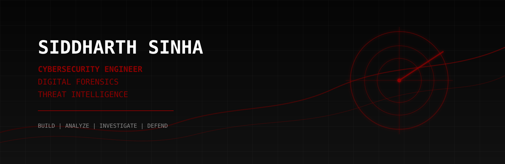
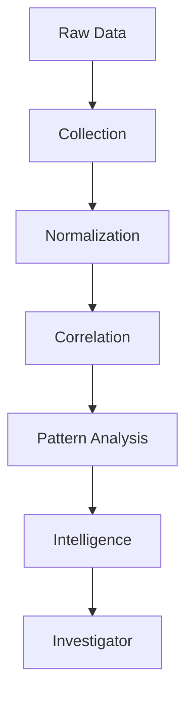
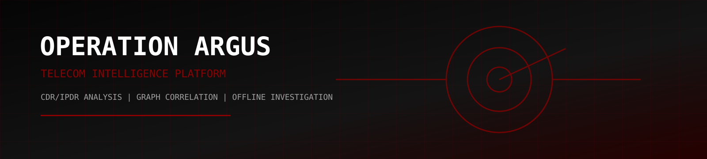
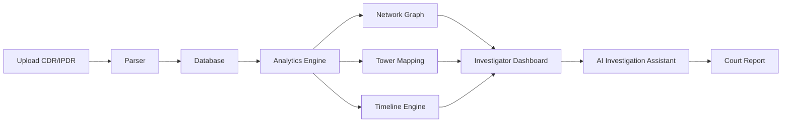
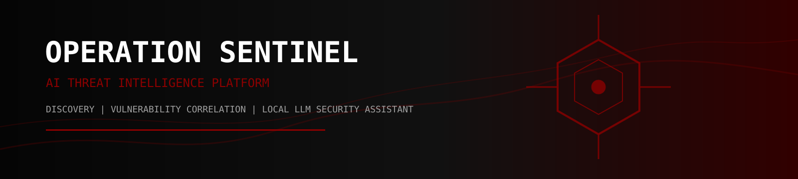
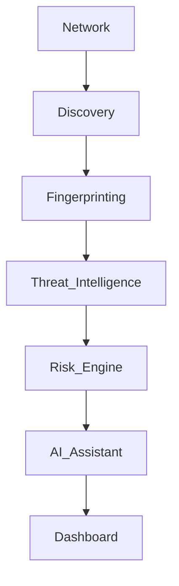
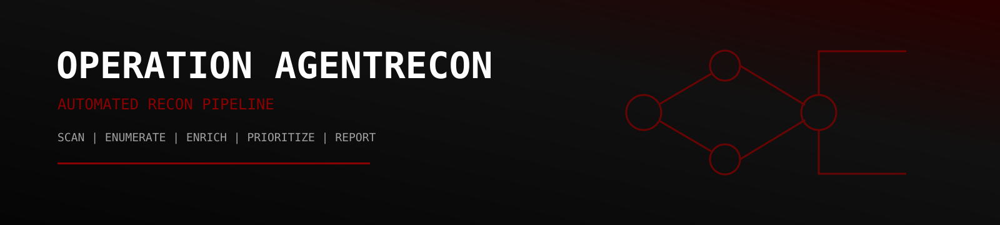
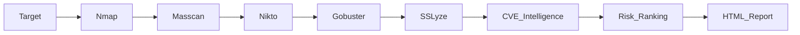
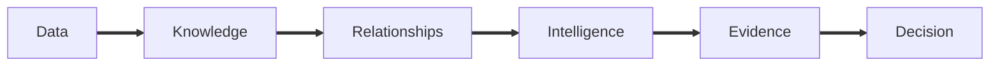
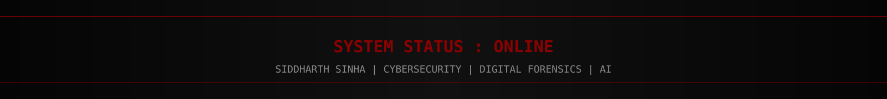

<div align="center">
  
  <br><br>

  [](https://git.io/typing-svg)

  <br><br>

  <a href="mailto:siddharthsinha1125@gmail.com"></a>
  <a href="https://github.com/Sid1125"></a>
  <a href="https://www.linkedin.com/in/ssinha1125/"></a>
  <a href="https://tryhackme.com/p/sid1125"></a>

  <br><br>
  
</div>

---

# > ACCESSING PERSONNEL RECORD...

```text
============================================================
       NATIONAL CYBER OPERATIONS DATABASE
============================================================

IDENTITY VERIFIED

NAME            Siddharth Sinha
STATUS          ACTIVE
CLEARANCE       RESEARCH
DIVISION        CYBERSECURITY
LOCATION        INDIA

LOADING MODULES...
[########################################] 100%

INITIALIZATION COMPLETE
============================================================
```

<table>
<tr>
<td width="60%">

# Siddharth Sinha

Cybersecurity student focused on **AI-powered security systems**, **digital forensics**, **telecom intelligence**, and **backend engineering**.

I build platforms that transform raw security data into actionable intelligence: from reconstructing communication networks to automating reconnaissance pipelines and designing privacy-first AI systems capable of operating in offline environments.

Instead of building isolated tools, I build **complete investigation ecosystems**.

</td>
<td width="40%">

```text
CURRENT MISSION

[OK] Telecom Investigation
[OK] AI Threat Intelligence
[OK] Digital Forensics
[OK] SOC Automation
[OK] Offline LLM Deployment
[OK] Network Intelligence
```

</td>
</tr>
</table>

---

<div align="center">
  
</div>

# CLASSIFIED DOSSIER

<table>
<tr>
<td width="33%">

```yaml
PERSONNEL_ID:
  SS-1125
NAME:
  Siddharth Sinha
STATUS:
  Active
SPECIALIZATION:
  Cybersecurity Engineering
```

</td>
<td width="33%">

```yaml
EDUCATION:
  B.Tech CSE
UNIVERSITY:
  Amity University Haryana
CGPA:
  8.46 / 10.00
GRADUATION:
  2027
```

</td>
<td width="33%">

```yaml
RESEARCH:
  - AI Security
  - Telecom Forensics
  - Threat Intelligence
  - Backend Systems
  - Network Analysis
  - Digital Investigations
```

</td>
</tr>
</table>

---

# OPERATIONAL STATUS

<table>
<tr>
<td align="center" width="33%">

### AI Systems

```text
██████████
ONLINE
```

</td>
<td align="center" width="33%">

### Threat Intelligence

```text
██████████
ONLINE
```

</td>
<td align="center" width="33%">

### Digital Forensics

```text
██████████
ONLINE
```

</td>
</tr>
<tr>
<td align="center" width="33%">

### Backend Engineering

```text
██████████
ONLINE
```

</td>
<td align="center" width="33%">

### Vulnerability Assessment

```text
██████████
ONLINE
```

</td>
<td align="center" width="33%">

### Research

```text
██████████
ONLINE
```

</td>
</tr>
</table>

---

# LIVE TELEMETRY

<table>
<tr>
<td width="25%" align="center">

## EXPERIENCE

```text
4+
Internships
```

</td>
<td width="25%" align="center">

## PROJECTS

```text
10+
Systems Built
```

</td>
<td width="25%" align="center">

## SECURITY

```text
100+
TryHackMe Days
```

</td>
<td width="25%" align="center">

## STATUS

```text
ONLINE
24 / 7
```

</td>
</tr>
</table>

---

# TECHNOLOGY ARSENAL

<div align="center">
  
  <br><br>
  
</div>

<br>

<table>
<tr>
<td width="25%">

### LANGUAGES
- Python
- C
- C++
- JavaScript
- TypeScript

</td>
<td width="25%">

### BACKEND
- FastAPI
- Node.js
- REST APIs
- SQLAlchemy
- WebSockets

</td>
<td width="25%">

### DATA
- PostgreSQL
- SQLite
- MySQL
- MongoDB
- Redis

</td>
<td width="25%">

### CYBER
- Burp Suite
- Nmap
- Metasploit
- Nikto
- Wireshark

</td>
</tr>
<tr>
<td width="25%">

### AI
- TensorFlow
- Keras
- Ollama
- RAG
- LoRA

</td>
<td width="25%">

### FRONTEND
- React
- Next.js
- TailwindCSS
- HTML
- CSS

</td>
<td width="25%">

### ANALYTICS
- Pandas
- NetworkX
- D3.js
- Leaflet
- Plotly

</td>
<td width="25%">

### DEVOPS
- Docker
- Linux
- GitHub Actions
- Bash
- Postman

</td>
</tr>
</table>

---

# CYBERSECURITY TOOLKIT

| Recon | Exploitation | Analysis | Intelligence |
|:--|:--|:--|:--|
| Nmap | Burp Suite | Wireshark | CVE |
| Masscan | Metasploit | NetworkX | AlienVault OTX |
| Gobuster | SQLMap | Pandas | AbuseIPDB |
| Nikto | OWASP | D3.js | MITRE ATT&CK |

---

# COMMAND CENTER

<div align="center">
  
</div>

<table>
<tr>
<td width="33%">

### ACTIVE OPERATIONS

```text
ARGUS
██████████
ONLINE
--------------
SENTINEL
████████░░
BUILDING
--------------
AGENTRECON
██████████
ONLINE
```

</td>
<td width="34%">

### SYSTEM HEALTH

```text
Backend
98%
--------------
Database
100%
--------------
Visualization
95%
--------------
AI Modules
91%
```

</td>
<td width="33%">

### INVESTIGATION STATUS

```text
Threat Intelligence
ACTIVE
--------------
Digital Forensics
ACTIVE
--------------
Network Analytics
ACTIVE
```

</td>
</tr>
</table>

---

# INVESTIGATION WORKFLOW



---

<div align="center">
  
</div>

# ACTIVE OPERATIONS

<div align="center">

*"Every system tells a story. My job is building the systems that uncover it."*

</div>

## OPERATION ARGUS



```text
CLASSIFICATION     : RESTRICTED
STATUS             : OPERATIONAL
TYPE               : Telecom Intelligence Platform
ENVIRONMENT        : Offline / Air-Gapped Compatible
PRIMARY LANGUAGE   : Python
ARCHITECTURE       : FastAPI + PostgreSQL + D3 + AI
```

Project ARGUS is a forensic-grade **CDR/IPDR investigation platform** designed for digital investigators and cybersecurity analysts.

Instead of simply displaying telecom records, ARGUS reconstructs relationships, movement patterns, communication behavior, and network intelligence from large telecom datasets. It is designed around offline-first architecture so it can operate inside secure environments without cloud connectivity.

<table>
<tr>
<td width="50%">

### Investigation
- Communication Graph Analysis
- Tower Movement Mapping
- Timeline Reconstruction
- Relationship Detection
- Number Profiling
- Pattern Correlation

</td>
<td width="50%">

### AI & Analytics
- Investigation Summaries
- Behavior Analysis
- Suspicious Cluster Detection
- Network Centrality
- Offline LLM Support
- Court-ready Report Generation

</td>
</tr>
</table>



<p>


</p>

<div align="center">
  <a href="https://github.com/Sid1125/tifm-cdr-ipdr-visualizer">
    
  </a>
</div>

---

## OPERATION SENTINEL



```text
CLASSIFICATION     : INTERNAL
STATUS             : ACTIVE DEVELOPMENT
TYPE               : AI Threat Intelligence Platform
DEPLOYMENT         : Offline SOC
```

Project SENTINEL is an AI-powered security operations platform for autonomous network discovery, vulnerability assessment, threat intelligence, and local-first security analytics.

<table>
<tr>
<td width="33%">

### Network Discovery
- ARP Discovery
- Host Enumeration
- Port Scanning
- Service Detection

</td>
<td width="33%">

### Threat Intelligence
- CVE Lookup
- Vulnerability Correlation
- Risk Prioritization
- Asset Inventory

</td>
<td width="33%">

### AI Layer
- Local LLM
- Natural Language Queries
- Report Generation
- Security Assistant

</td>
</tr>
</table>



<p>


</p>

<div align="center">
  <a href="https://github.com/Sid1125/Project-SENTINEL">
    
  </a>
</div>

---

## OPERATION AGENTRECON



```text
STATUS             : DEPLOYED
TYPE               : Automated Recon Pipeline
MISSION            : Attack Surface Intelligence
```

AgentRecon orchestrates multiple reconnaissance tools into a unified intelligence pipeline capable of scanning, enumerating, enriching, and prioritizing findings automatically.



<table>
<tr>
<td width="50%">

### Recon Modules
- Host Discovery
- Port Enumeration
- Web Enumeration
- TLS Analysis

</td>
<td width="50%">

### Intelligence Layer
- CVE Enrichment
- False Positive Reduction
- HTML Reporting
- ML Prioritization

</td>
</tr>
</table>

<p>


</p>

<div align="center">
  <a href="https://github.com/Sid1125/AgentRecon">
    
  </a>
</div>

---

<div align="center">
  
</div>

# RESEARCH SYSTEMS

<table>
<tr>
<td width="48%">

## AI RESEARCH AGENT

```text
STATUS      : STABLE
CATEGORY    : Retrieval-Augmented Generation
MODE        : Fully Offline
```

A private knowledge assistant built for environments where confidentiality matters. It combines semantic retrieval, traditional information retrieval, and locally deployed language models to answer questions grounded in user-owned documents.

**Features**
- Local document ingestion
- Hybrid retrieval
- TF-IDF ranking
- Embedding search
- Extractive fallback
- Hallucination-resistant responses

[View project](https://github.com/Sid1125/Primitive-Research-RAG)

</td>
<td width="4%"></td>
<td width="48%">

## F1 INSIGHT

```text
STATUS      : RELEASED
CATEGORY    : Predictive Analytics
```

A Formula 1 analytics platform capable of predicting race outcomes, evaluating pit strategies, tyre degradation, and historical race trends through machine learning.

**Features**
- Race prediction
- Strategy simulation
- Driver comparison
- Telemetry analytics
- Interactive dashboards
- AI-assisted querying

[View project](https://github.com/Sid1125/F1-Insight)

</td>
</tr>
</table>

<table>
<tr>
<td width="48%">

## HITMEN

```text
STATUS      : DEPLOYED
CATEGORY    : Community Intelligence
```

A crowdsourced reporting platform focused on harmful-content tracking and moderation workflows.

[View project](https://github.com/Sid1125/hitmen_epi_prevention)

</td>
<td width="4%"></td>
<td width="48%">

## OIA INTERNATIONAL HUB

```text
STATUS      : LIVE
CATEGORY    : University Platform
```

A modern international collaboration platform developed for the Office of International Affairs.

[Live site](https://global-connect-hub-two.vercel.app/)

</td>
</tr>
<tr>
<td width="48%">

## INNOVATHON

```text
STATUS      : LIVE
CATEGORY    : Event Platform
```

Complete hackathon management platform supporting registrations, judging criteria, sponsor showcases, and participant engagement.

[Live platform](https://innovathon2.onrender.com)

</td>
<td width="4%"></td>
<td width="48%">

## CLIPSYNC

```text
STATUS      : LIVE
CATEGORY    : Productivity
```

A secure clipboard management platform for authenticated storage, retrieval, organization, and search of frequently used snippets.

[Live site](https://clip-sync-three.vercel.app/sign-in.html)

</td>
</tr>
</table>

---

# SYSTEM DESIGN PRINCIPLES

<table>
<tr>
<td width="33%">

### Security
- Principle of least privilege
- Offline-first architecture
- Privacy by design
- Secure defaults

</td>
<td width="33%">

### Performance
- Efficient APIs
- Lightweight services
- Database optimization
- Fast visualizations

</td>
<td width="33%">

### Maintainability
- Modular architecture
- Documentation
- Type safety
- Reusable components

</td>
</tr>
</table>

---

# EXPERIENCE LOG

```text
----------------------------------------------------------------------------
                           OPERATIONAL TIMELINE
----------------------------------------------------------------------------
```

<table width="100%">
<tr>
<td width="18%" align="center">

## 2026

</td>
<td width="82%">

### CYBER SECURITY SUMMER INTERN
**Gurugram Police Cyber Security Summer Internship (GPCSSI)**

Worked on investigation-focused cybersecurity projects inspired by real operational requirements. Designed systems centered around telecom intelligence, AI-assisted analysis, backend architecture, and digital investigation workflows.

</td>
</tr>
<tr>
<td align="center">

## 2025

</td>
<td>

### STUDENT INTERN
**Amity University Haryana**

Designed and developed institutional software platforms while contributing to backend services, data processing pipelines, automation, and university technology initiatives.

</td>
</tr>
<tr>
<td align="center">

## 2025

</td>
<td>

### CYBER SECURITY INTERN
**National Informatics Centre (MeitY)**

Participated in vulnerability assessment and security analysis activities across government technology infrastructure. Worked with reconnaissance and assessment tools including Nmap, Nikto, HTTPX, SSLyze, Wappalyzer, and Nuclei.

</td>
</tr>
<tr>
<td align="center">

## 2024

</td>
<td>

### CYBER SECURITY INTERN
**Embrizon Technologies**

Received practical exposure to penetration testing, reconnaissance, vulnerability assessment, reporting, and cybersecurity methodologies.

</td>
</tr>
<tr>
<td align="center">

## 2024

</td>
<td>

### WEB DEVELOPMENT INTERN
**Prodigy InfoTech**

Built responsive web applications while strengthening frontend engineering practices and JavaScript development.

</td>
</tr>
</table>

---

# CERTIFICATIONS

<table>
<tr>
<td width="50%">

### Cybersecurity
- Fortinet Certified Fundamentals
- IBM Cybersecurity Fundamentals
- Cisco Introduction to Cybersecurity

</td>
<td width="50%">

### Development
- Google Cloud Fundamentals
- Google Generative AI
- Responsive Web Design
- JavaScript Algorithms & Data Structures

</td>
</tr>
</table>

---

# ACHIEVEMENTS

<table>
<tr>
<td width="33%" align="center">

## TROPHY
### IIT Bombay CTF
13th Place  
IEEE-CS x IIT Bombay Trust Lab

</td>
<td width="33%" align="center">

## STREAK
### TryHackMe
100-Day Streak  
Level 0x8 Hacker

</td>
<td width="33%" align="center">

## BUILD
### SIH 2024
Participant  
National Innovation Challenge

</td>
</tr>
</table>

---

# EDUCATION

<table>
<tr>
<td width="100%">

## Bachelor of Technology
**Computer Science Engineering**  
Amity University Haryana  
2023 - 2027

```text
CGPA: 8.46 / 10.00
```

### Leadership
- Mission Veerangana Organising Team
- Former Nihon Culture Club Coordinator
- University Digital Club Member

</td>
</tr>
</table>

---

<div align="center">
  
</div>

# GITHUB ANALYTICS

<div align="center">
  
  
  <br><br>
  
</div>

---

# CONTRIBUTION GRAPH

<div align="center">
  
</div>

---

# CURRENT RESEARCH

```text
============================================================
ACTIVE RESEARCH DIRECTIVES

[01] Telecom Intelligence Systems
[02] Digital Investigation Platforms
[03] AI-assisted Threat Hunting
[04] Local Language Models
[05] Backend Architecture
[06] Network Intelligence
[07] Automated Reconnaissance
[08] MITRE ATT&CK Simulation
============================================================
```

---

# DEVELOPMENT METRICS

```text
Backend Engineering         ████████████████████████ 95%
Cybersecurity               ███████████████████████  92%
Threat Intelligence         █████████████████████    86%
Artificial Intelligence     ████████████████████     83%
Frontend Development        ████████████████         72%
```

---

# ENGINEERING PHILOSOPHY



<table>
<tr>
<td width="33%">

### Collect
Acquire information from multiple sources while preserving integrity.

</td>
<td width="33%">

### Correlate
Link entities through graph analysis and contextual enrichment.

</td>
<td width="33%">

### Investigate
Present evidence through intuitive visual interfaces instead of raw datasets.

</td>
</tr>
</table>

---

# SYSTEM PHILOSOPHY

> Modern cybersecurity is not about producing more alerts. It is about producing better intelligence.

Security analysts do not need another dashboard. They need systems capable of collecting fragmented information, discovering relationships, reconstructing events, and presenting evidence in a form that supports real investigation.

That philosophy drives every project I build.

---

# REPOSITORY SPOTLIGHT

<div align="center">
  <a href="https://github.com/Sid1125/tifm-cdr-ipdr-visualizer"></a>
  <a href="https://github.com/Sid1125/Project-SENTINEL"></a>
  <a href="https://github.com/Sid1125/AgentRecon"></a>
  <a href="https://github.com/Sid1125/Primitive-Research-RAG"></a>
</div>

---

# CURRENT LEARNING ROADMAP

```text
2026
████████████████████████████████████████  Telecom Intelligence
██████████████████████████████            MITRE ATT&CK Automation
████████████████████████████              Offline AI Agents
██████████████████████████                Graph Analytics
██████████████████████████████            Distributed Backend Systems
████████████████████████████████          Cyber Threat Intelligence
```

---

# OPERATING ENVIRONMENT

| Environment | Usage |
|:--|:--|
| Linux | Daily Development |
| Windows | Testing & Deployment |
| Docker | Containerization |
| GitHub Actions | CI/CD |
| Ollama | Local AI |
| PostgreSQL | Primary Database |
| SQLite | Lightweight Storage |
| FastAPI | Backend Services |

---

# TERMINAL

```bash
$ whoami
Siddharth Sinha

$ role
Cybersecurity Engineer

$ specialization
Telecom Intelligence
Digital Forensics
Threat Intelligence
AI Systems

$ objective
Transform fragmented security data
into actionable intelligence.

$ status
ONLINE
```

---

# CONTACT

<div align="center">
  <a href="mailto:siddharthsinha1125@gmail.com"></a>
  <a href="https://github.com/Sid1125"></a>
  <a href="https://www.linkedin.com/in/ssinha1125/"></a>
  <a href="https://tryhackme.com/p/sid1125"></a>
</div>

---

<div align="center">

```text
============================================================
      COLLECT
          |
      CORRELATE
          |
      UNDERSTAND
          |
      DEFEND
============================================================
```

## Building Intelligence Systems



</div>
